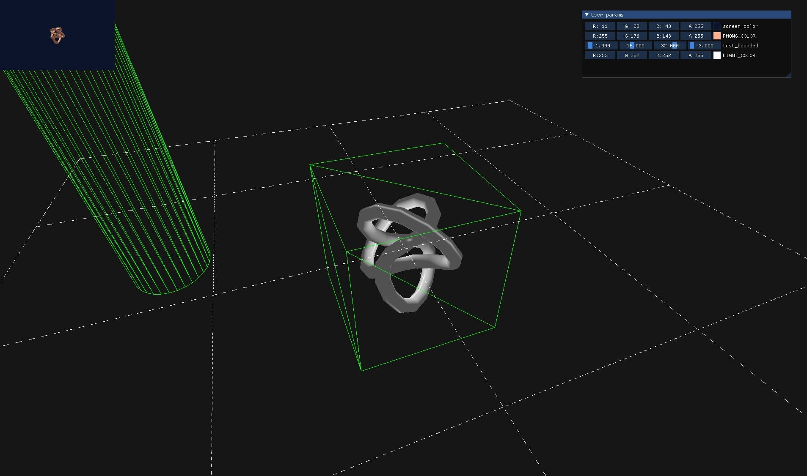

# playgl
A playground for experimenting with OpenGL.

<p align="center"></p>

__Playgl__ is a C++ header-only library for OpenGL prototyping (version 4.6-core).
It was created as an easy-to-use playground for rendering techniques. It tries to abstract nitty-gritty details of gpu to allow user to focus on shaders workflow. It tries to keep GPU abstraction lightweight to allow easy tinkering if one needs it. Currently it supports only Windows MSVC compiler (C++17). The library is still in early stage of development and it is bound to change.

## Features
* Orbit camera support
* Editable parameters with automatic GUI and shader propagation
* Built-in primitives support
* Debug renderer
* Basic support for static models (gltf 2.0)
* Basic support for textures (stb_image)
* Postprocessing workflow API
* Gpu state caching
* OpenGL debugging support (output, labels, scopes)

## Dependencies
* glfw
* glad
* glm
* imgui
* stb_image
* par_shapes
* meow_hash
* tinygltf
* fmt

## Example
```c++
#define PGL_DEFINE_MAIN
#include "playgl.h"

void pgl_init(Store& store) {
    store["screen_color"] = Color(0.5f, 0.5f, 0.5);
    store["PHONG_COLOR"] = Color(0.7f, 0.4f, 0.3f);
    store["LIGHT_COLOR"] = Color(0.8f, 0.2f, 0.4f);
    store["test_bounded"] = BoundedParam(vec4(-1.f, 15.f, 32.f, -3.f), -5, 50);
}

void pgl_update(System& system) {
    system.camera.canvas.color = system.store["screen_color"];
};

void pgl_render(System& system) {
    system.geometry(geometry::TrefoilKnot<>{})
        .shader("phong.vs", "phong.fs")
        .param("world", mat4(1.f))
        .param("view", system.camera.geometry.get_view())
        .param("projection", system.camera.geometry.get_projection())
        .render();

    system.debug.grid().edge(10.f);
    system.debug.model("test.glb");
    system.debug.texture(
        system.camera.canvas.framebuffer->color_texture.value());

    system.postprocess(*system.camera.canvas.framebuffer)
        .with("grayscale.fs")
        .resulting("#grayscale");

    system.postprocess("#grayscale")
        .with("postprocess.fs")
        .resulting(*system.camera.canvas.framebuffer);
};
```
